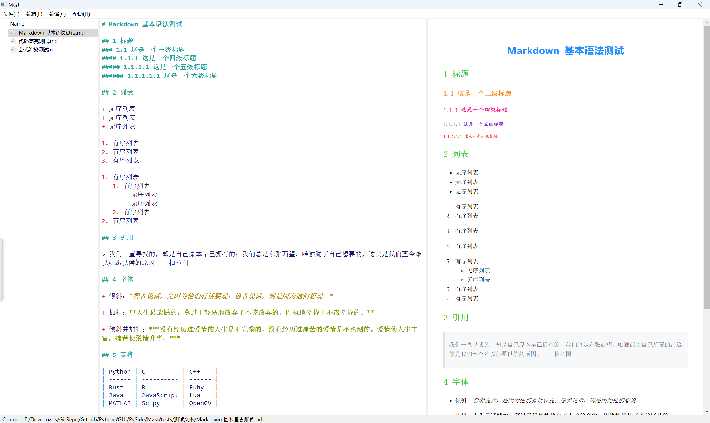
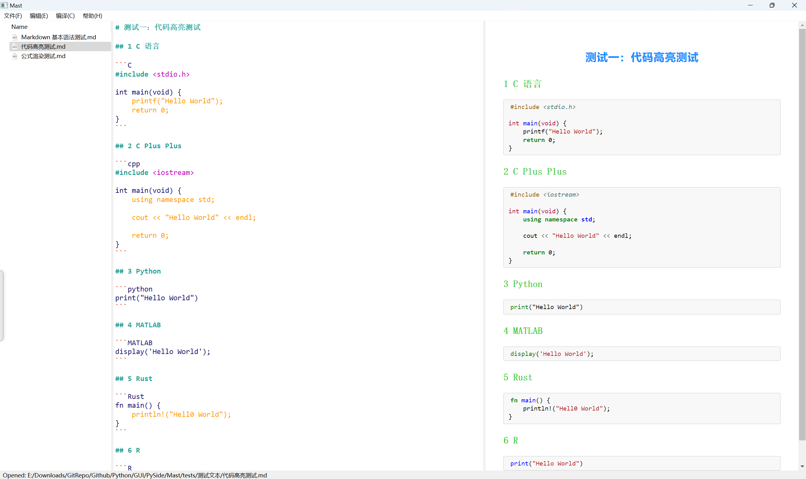
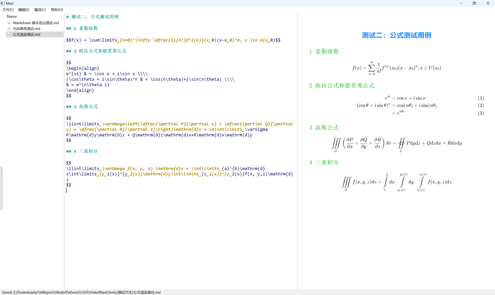

# Mast

## 简介

本项目为一个功能完善的 Markdown 编辑器，是我为我的Python程序设计课程而设计的项目，用作期末考核。

这是作者第一次开发一个完整的项目，不足之处请不吝赐教，万分感谢！

## 特色

+ 支持 Markdown 源码的语法高亮
+ 支持 Markdown 的实时预览
+ 支持 Markdown 所有基础语法
+ 支持 LaTeX 公式渲染
+ 支持自定义主题样式

## 效果展示

<p align="center">
    
</p>
<p align="center">
    Markdown 基本语法测试
</p>


<p align="center">
    
<p align="center">
    语法高亮测试
</p>


<p align="center">
    
</p>
<p align="center">
    公式渲染测试
</p>


## 如何使用

### 安装

1. 克隆仓库

```bash
git clone https://github.com/JoeAndMark/Mast.git
```

2. 安装所需的依赖

```bash
pip insatll -r requirments.txt
```

> python >= 3.8.4

3. 运行

```bash
cd Mast
python app.py
```

### 打包

使用如下命令进行打包：

```bash
pyinstaller -D -i "mast.ico" app.py -n Mast
```

## 项目架构

目录结构：

```bash
Mast
+---docs
|
+---highlighter
|
+---mast
|   +---resources
|   |   +---icons
|   |   +---styles
|   |   +---templates
|   |   +---themes
|
+---README
|
+---tests
|   +---测试文本
```

文件夹描述：

+ `docs`：项目开发文档，包括 `api` 等信息。
+ `highlighter`：代码编辑区代码的语法高亮实现，现已经整合到 `Mast` 库下的 `highlighter.py` 模块中，但暂未弃用。
+ `mast`：软件的实现库，包含 GUI 以及各种操作逻辑的实现。
  + `resources`：软件的资源文件夹，包括 `icons`、`styles`、`templates`、`themes` 文件夹
+ `README`：存放 `README.md` 中所使用的图片
+ `test`：单元测试文件，包含 `mast` 库中所有模块的测试文件
  + `测试文本`：Markdown 渲染测试所使用的 `.md` 文件

> 模块描述已写入模块文档，即所有 `.py` 文件顶部。

## 命名约定

本项目所有代码遵循以下命名约定：

+ 类的命名使用**大驼峰命名法**
+ 函数、方法和变量的命名使用**小驼峰命名法**
+  私有方法和私有属性以单下划线 `_` 开头
+ 所有 `handler` 类的方法以相应**前缀**开头，如与 `FileHandler` 有关的方法 `fileOpen`、`fileNew`、`fileSave` 等

## TODO

- [ ] 支持 Mermaid 的渲染
- [ ] 支持 ECharts 的渲染
- [ ] 支持 TikzJax 的渲染
- [ ] 支持自定义设置
- [ ] 支持纯本地化运行，而不再依赖于 CDN 进行渲染
- [ ] 代码重构


> TODO List 的内容没有先后顺序

## 参考资料

本项目使用的所有的参考资料如下：

+ [MarkdownHighlighter](https://github.com/rupeshk/MarkdownHighlighter)
+ 《PySide6/PyQt6 快速开发与实战》——孙洋洋、王硕著
+ 软件图标取自于阿里巴巴矢量图标库的 `mastodon`，作者为木子若若
+ 本项目还参考了多份网友的教程，但找不到在哪里了……


> 在这里由衷的感谢所有为这个项目提供帮助的人，祝好！
>
> 也祝愿我下周的答辩能拿到一个不错的成绩，不然我就只能老老实实参加期末考试了，然而我写这个项目的初衷之一就是因为我不想期末考试…… ——2024.6.7

